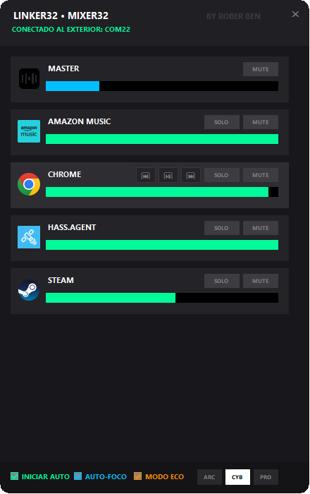

# 🎛️ Linker32 & PIXER32

Un ecosistema completo de hardware y software diseñado para ofrecerte un control físico, táctil y absoluto sobre el mezclador de audio de Windows. 

Compuesto por **Linker32** (una aplicación de escritorio en C# .NET) y **Mixer32** (un periférico basado en ESP32 con pantalla OLED), este proyecto te permite gestionar el volumen independiente de tus aplicaciones, mutear, aislar canales y controlar tu multimedia sin tener que hacer Alt+Tab.

## ✨ Características Principales

### 🖥️ Software (Linker32 - PC)

* **Control por Aplicación:** Extrae dinámicamente las sesiones de audio de Windows (Spotify, Chrome, Discord, Juegos) y te permite controlarlas individualmente.
* **Auto-Foco Inteligente:** Detecta qué ventana tienes activa y cambia el control del encoder automáticamente a esa aplicación. Monitoriza canales nuevos en tiempo real.
* **Bypass de Sandbox:** Extracción de iconos de procesos a bajo nivel para una interfaz gráfica rica y moderna.
* **Modo Invisible:** Funciona en la bandeja del sistema de Windows con opción de auto-arranque silencioso.
* **Sistema OTA (Over-The-Air) Integrado:** Actualiza el firmware del hardware por Bluetooth directamente desde el PC con un protocolo blindado "Ping-Pong" antipérdidas.

### 🕹️ Hardware (PIXER32)

* **Feedback Visual OLED:** Muestra el nombre de la app, el artista/canción actual, el nivel de volumen, barras de progreso de actualización y estados de conexión.
* **Temas Visuales:** 3 estilos gráficos intercambiables en caliente (ARC - Arcade, CYB - Cyberpunk, PRO - Broadcast).
* **Modo ECO:** Gestión inteligente de energía que apaga la pantalla tras un periodo de inactividad.
* **Botones Multimedia y Tácticos:** Soporte para atajos de Play/Pause, Next, Prev, Mute Maestro y Modo SOLO (aislar el audio de una sola aplicación).
  

## 🛠️ Requisitos de Hardware

Para construir tu propio PIXER32 necesitarás:
* Placa de desarrollo **ESP32** (con Bluetooth clásico activado).
* Pantalla **OLED SSD1306** (I2C).
* Encoder rotativo **KY-040**(con pulsador integrado).
* 3 Interruptores de teclado Cherry mecanicas (para funciones multimedia/macros).
* 2 Resistencias de 100k

## 🚀 Instalación y Uso

### 1. El Hardware (Arduino IDE)
1. Abre el archivo `.ino` incluido en el IDE de Arduino.
2. Instala las librerías necesarias (Adafruit SSD1306, BluetoothSerial, etc.).
3. Flashea tu placa ESP32 por cable USB (solo es necesario la primera vez, las siguientes actualizaciones se pueden hacer de forma inalámbrica vía OTA desde el programa de PC).

### 2. El Software (Windows)
1. Descarga la última *Release* desde la pestaña de "Releases" de GitHub.
2. Ejecuta `Linker32.exe`.
3. Empareja tu ESP32 con Windows a través de la configuración de Bluetooth del sistema.
4. El programa detectará el puerto COM automáticamente, se sincronizará con la placa y comenzará a enviar los datos de audio.

## 📡 Protocolo OTA Seguro
Linker32 incluye un flasheador inalámbrico customizado. Si detecta que la versión de hardware es antigua, ofrecerá actualizar la placa. Utiliza un algoritmo de *chunking* de 512 bytes con comprobación de integridad (Magic Byte) y un *handshake* estricto para asegurar que la placa nunca se *brickee* durante la actualización.

## 👨‍💻 Autor
Creado y desarrollado por **Rober Ben**.

Si este proyecto te ha resultado útil, ¡no dudes en dejar una ⭐ en el repositorio!
